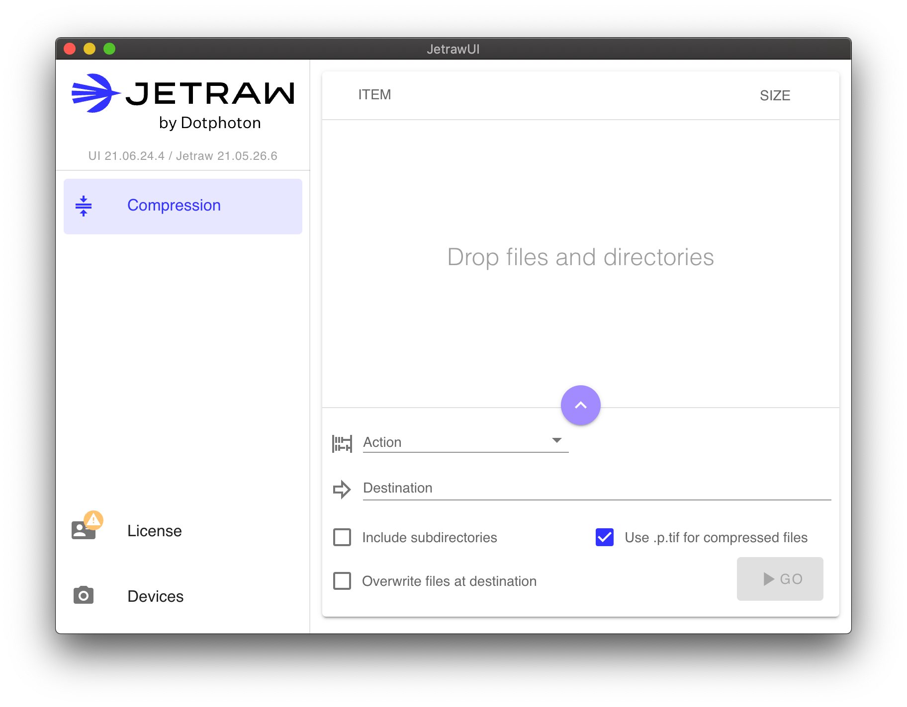

# Jetraw Image Compression
This repository hosts releases of the Jetraw image compression software. For more information about Jetraw, please visit https://jetraw.com/.

# Table of contents
- [Jetraw Image Compression](#jetraw-image-compression)
- [Table of contents](#table-of-contents)
- [Quick start](#quick-start)
  - [Jetraw UI](#jetraw-ui)
    - [Windows installation](#windows-installation)
    - [macOS installation](#macos-installation)
    - [Setup and compression](#setup-and-compression)
  - [Linux](#linux)
- [Device identifiers](#device-identifiers)
- [Command line utilities](#command-line-utilities)
  - [Noise replacement with DPCore](#noise-replacement-with-dpcore)
    - [Displaying identifiers](#displaying-identifiers)
    - [Performing noise replacement](#performing-noise-replacement)
  - [Compression and decompression with Jetraw](#compression-and-decompression-with-jetraw)
  - [Convenient use of the command lines on macOS](#convenient-use-of-the-command-lines-on-macos)
  - [Convenient use of the command lines on Linux](#convenient-use-of-the-command-lines-on-linux)
- [Development libraries](#development-libraries)
- [Wrappers and plugins](#wrappers-and-plugins)
- [Configuration files](#configuration-files)
  - [Windows](#windows)
  - [macOS](#macos)
  - [Linux](#linux-1)
  - [Contact](#contact)
# Quick start

Jetraw can be used free of charge for decompression. You can try compression on a sample set of microscopy images by applying for the free testing kit at https://jetraw.com/downloads/software.

## Jetraw UI
On Windows and macOS, Jetraw comes with a UI, where you can easily enter and check your license data, install and view device calibrations, and compress / decompress TIFF files.



To get started, you can follow the following steps.
### Windows installation
1. Download the Windows installer (MSI file) for the [latest (pre-)release](https://github.com/Jetraw/Jetraw/releases).
2. Run JetrawUI, either from the installer or from the start menu.

### macOS installation
1. Download macOS disk image (DMG file) for the [latest (pre-)release](https://github.com/Jetraw/Jetraw/releases).
2. Open the disk image in Finder and drag `JetrawUI.app` onto the `Applications` folder. Launch JetrawUI from the Applications folder.

### Setup and compression
1. Enter your license key after following the corresponding menu item on the left side.
2. To add support for a camera, click on "devices" on the left and drag-and-drop the file with the extension `.dat` file that you received onto the right panel. A new device should appear.
3. Open the compression panel. Drop some TIFF files, acquired with the device that you installed above. Choose *compress* as action and select the identifier that matches the camera settings. After choosing a destination directory, you can start the compression by clicking the "Go" Button.

## Linux
On Linux, Jetraw does not yet come with JetrawUI. You can install the command line utilities and development libraries by downloading and unpacking the `.tar.gz` file of the [latest (pre-)release](https://github.com/Jetraw/Jetraw/releases).

The license key will be found by Jetraw if placed in a file `~/.config/jetraw/license.txt`

Camera calibration files with extension `.dat` should be copied to the directory `~/.config/dpcore/`.

Instructions on how to use the command lines are given below.


# Device identifiers
> :warning: To achieve its high compression ratio, Jetraw relies on knowledge of the exact statistics given by the *camera profile* to perform noise-replacement. These depend on the camera's unique serial number, as well as the settings that were used to acquire the image. In Jetraw, these are accessed through *identifiers*.
> Using the wrong identifier **may reduce image quality**.
‍
# Command line utilities
Command line utilities can be run after opening a Command Prompt / PowerShell / Terminal. The use of the utilities is identical on all operating systems.

In general, Jetraw compression consists of two steps.
1. Accurate noise replacement with the help of camera calibration data provided through an *identifier*.
2. Lossless compression of the noise-replaced data.

The noise-replacement need only be performed once, after which lossless compression and decompression can be performed any number of times.

In JetrawUI, noise-replacement is done automatically if necessary. When using the command line, two separate commands offer more fine-grained control.

## Noise replacement with DPCore
The command line utility `dpcore` is used to perform noise replacement. Optionally, this can be combined with compression. To see a description of all possible options for `dpcore`, run
```
dpcore --help
```

### Displaying identifiers
To show all installed identifiers together with a short description, you can run
```
dpcore --list-ids
```

### Performing noise replacement
The minimal command to perform noise replacement is
```
dpcore [-c] -d <destination> -i <identifier> <sources>
```
The argument are as follows:
- `-c` is optional and will apply compression to the noise-replaced files.
- `-d <destination>` specifies the destination directory. The directory will be created if it doesn't exist.
- `<sources>` are source files (extension must be `.tif` or `.tiff`) or directories containing those files.

## Compression and decompression with Jetraw
Prepared images can then be compressed and decompressed without loss using `jetraw`. As above, you can run
```
jetraw --help
```
to get a list of all available options.

Jetraw does not need camera calibration information, because it was embedded into the image data by `dpcore`. Hence, using `jetraw` is usually as simple as
```
jetraw compress -d compressed c1.tif
jetraw decompress -d decompressed c1.p.tif
```

## Convenient use of the command lines on macOS
On macOS, the command lines are bundled with the App and can be found at `/Applications/Jetraw\ UI.app/Contents/jetraw/bin/`. To conveniently run them from any other directory, you have two options.

1. Create symbolic links. This method is recommended, because it is intuitive and permanent. Open a terminal and run the following commands
    ```
    ln -s "/Application/Jetraw UI.app/Contents/jetraw/bin/jetraw" /usr/local/bin/
    ln -s "/Application/Jetraw UI.app/Contents/jetraw/bin/dpcore" /usr/local/bin/
    ```

2. Give macOS an additional location to look for executables by adding the Jetraw directory to the `PATH` environment variable. Open a terminal and run
    ```
    export PATH="$PATH:/Application/Jetraw UI.app/Contents/jetraw/bin"
    ```
    You will also have to re-run the command when you open a new terminal. To avoid this, you can add the above line to the file `.zshrc` (`.bashrc` on older systems) in your home directory.

## Convenient use of the command lines on Linux
Similar to macOS, Linux usually must be told where to look for the command line utilities, because they are not installed in the system's default location. What works for macOS should also work on Linux, provided that you provide the correct location for Jetraw, namely where you unpacked the downloaded `.tar.gz` file.

# Development libraries
Jetraw comes with libraries and header files that allow to integrate the functionality of `dpcore` and `jetraw` directly into your applications. For function descriptions, please have a look at the header files in the `include` subdirectory of the Jetraw installation.

# Wrappers and plugins
The files written by JetrawUI, `dpcore` and `jetraw` are standard TIFF files. However, accessing the image data requires the TIFF reader to be aware of the installed Jetraw codec. To this end, we offer a number of wrapper modules and plugins for popular programming languages and imaging software. Please visit `https://jetraw.com/downloads/software` for a list, and let us know if you require integration with other software.

# Configuration files
Jetraw uses a small number of configuration files at standard locations.

## Windows
- `%APPDATA%\jetraw` stores the current license key in the file `license.txt`, and license validation data in files with extension `.lic`.
- `%APPDATA%\dpcore` contains camera calibration data.

## macOS
As for Windows, except that `%APPDATA$` should be replaced by `~/Library/Application Support/`

## Linux
As for Windows, except that `%APPDATA$` should be replaced by `~/.config/`

## Contact
Feel free to use the [issues section](https://github.com/Jetraw/Jetraw/issues) to report bugs or request new features. You can also ask questions and give comments by visiting the [discussions](https://github.com/Jetraw/Jetraw/discussions), or following the contact information at https://jetraw.com.
