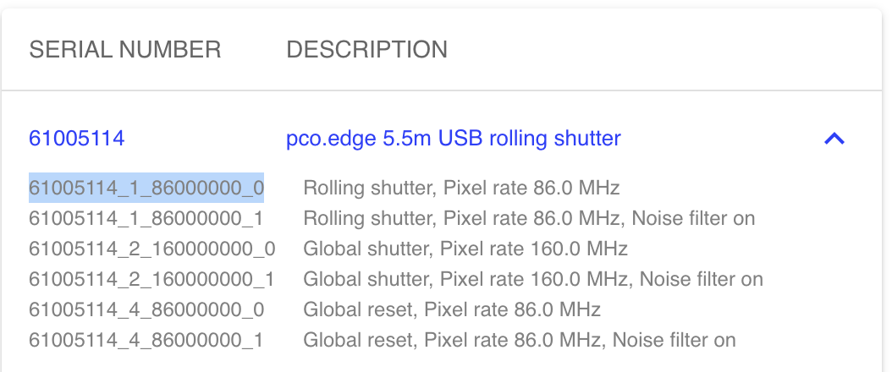

# C++ Jetraw Onboarding docs

This is a proposal to add a better UX for customers trying to get started with the C++ libraries.

---

# Introduction

Welcome to the official documentation of the C++ API of the official Jetraw and Dotphoton core distributions. This documentation aims to be as unopinionated as possible, it is up to the users to choose the tools they want to integrate into their project.

The Jetraw algorithm is responsible for compressing images after they were prepared by Dotphoton Core. The following guide should help you get started with it. If you have any feedback, issues or concerns, [feel free to create an Issue here](http://google.com) and we will do our best to resolve it as fast as we can!

> Note: Throughout this documentation, Dotphoton Core will be referred to as DPCore.


# Prerequisites.

You need these things to get started:

1. A  modern C++ compiler (g++, clang++, etc..). Please make sure that you can compile code that conforms to the C++17 standard, as it is required for some features to work properly. In this guide, clang will be used, however, feel free to use whatever you want!
2. Jetraw UI or the Library files installed on your System. [Download here!](https://www.jetraw.com/)
3. A valid & active Jetraw license, on MacOS and Windows, activating licenses is achieved by using the Jetraw UI, going to the License tab and pasting it in. On Linux, the license key has to be placed in a file called: `~/.config/jetraw/license.txt`
4. A build system like CMake, Meson or Bazel. This guide will use CMake, as it is very frequently used and it immensely simplifies your workflow.
5. LibSSL, as it is a dependency of Jetraw and DPCore, on macOS it's the `openssl` homebrew package, on Ubuntu it's called `libssl-dev` 
6. A way to interact with TIFF files, e.g. [LibTIFF](http://www.libtiff.org/), a C/C++ library for loading and interacting with TIFF Images.
    
---
    

# Setup

There are certainly many ways to go about setting this up properly, and this is merely one of them. Let's create a directory for our project:

```bash
$ mkdir hello_jetraw
$ cd hello_jetraw
```

Here, we copy all the dynamic libraries and header files into their separate folders, called `lib` and `include` , respectively. But first, we need to find the dynamic libraries to use in our project. 

## Where to find dynamic libraries?

On Linux, you get a `.tar` archive, where you only need to unpack it, then you already get a `lib` and `include` folder, you can just copy them into your project folder.

On OS X and Windows, you will find those directories in the `jetraw` subfolder inside Jetraw UI's installation path. For example, on a Mac, you usually find it under this path:

`/Applications/Jetraw\ UI.app/Contents/jetraw` 

Moving on, copy `lib` and `include` into our project folder like so:

```bash
$ cp -r /path/to/jetraw/lib /path/to/jetraw/include .
```

Create a new file as an entry point to your application, followed by a `CMakeLists.txt`:

```bash
$ touch main.cpp CMakeLists.txt
```

Edit the contents of your `CMakeLists.txt` to your liking, for our guide here, this is enough:

```makefile
cmake_minimum_required(VERSION 3.10)

set(CMAKE_CXX_STANDARD 17)
set(CMAKE_CXX_STANDARD_REQUIRED ON)

project(hello_jetraw VERSION 1.0)
add_executable(hello_jetraw main.cpp)

target_include_directories(hello_jetraw PUBLIC 
    ${CMAKE_CURRENT_SOURCE_DIR}/include)

# Change the library extension according to your system, 
# i.e on Linux, libraries end in '.so'
target_link_libraries(hello_jetraw 
    ${CMAKE_CURRENT_SOURCE_DIR}/lib/libdpcore.dylib 
    ${CMAKE_CURRENT_SOURCE_DIR}/lib/libjetraw.dylib
    ${CMAKE_CURRENT_SOURCE_DIR}/lib/libjetraw_tiff.dylib)
```

Let's make sure everything builds correctly. Put this into your `main.cpp` to make sure CMake picks up the libraries:

```cpp
#include <iostream>

#include "dpcore/dpcore.h"
#include "jetraw/jetraw.h"

int main() {
    std::cout << "Hello Jetraw & DPCore" << '\n';
    return 0;
}
```

To build and compile, create a `build` directory then run `cmake`  and `make` inside of it.

```bash
$ mkdir build
$ cd build
# -DCMAKE_BUILD_TYPE=Debug is also an option, 
# for optimal speed and compiler optimization, Release is a good build type..
$ cmake .. -DCMAKE_BUILD_TYPE=Release
$ cmake --build .
```

This will (hopefully) compile and generate a binary called `hello_jetraw` and when running it you should be greeted with the following message:

```bash
$ ./hello_jetraw
Hello Jetraw & DPCore
```

Great! Now you are all set up with your C++ project, it's now time to start exploring the functionality that Jetraw and DPCore have to offer.
## Using Microsoft Visual Studio
If you are using an IDE like Visual Studio, you could either load the folder with your `CMakeLists.txt` into Visual Studio and configure your Solution through it, as described [here.](https://docs.microsoft.com/en-us/cpp/build/cmake-projects-in-visual-studio?view=msvc-170) Alternatively, you can set up a project in which you specify header and libraries manually, which you can absolutely do using this guide [here.](https://docs.microsoft.com/en-us/cpp/build/adding-references-in-visual-cpp-projects?view=msvc-170)

---

# Hello, Jetraw

A simple workflow utilising Jetraw and DPCore, might look something like this:

- Prepare a loaded image buffer.
- Compress it.
- Save it to a file.

## A note on obtaining Image Buffers.

There are many ways to go about obtaining image buffers to perform Jetraw compression on them, thus, obtaining image buffers will not be explained throughout this guide, it will just be assumed that the user has access to an image buffer of a valid TIFF image. If you do not know how to go about loading a TIFF file, [LibTIFF, a C/C++ library for interacting with TIFF images is a good place to start.](http://www.libtiff.org/libtiff.html) 

---

Anyways, let's look at how the code might look like, don't worry if you don't understand everything, we will go through this bit by bit:

```cpp
#include "dpcore/dpcore.h"
#include "jetraw/jetraw.h"
#include "jetraw_tiff/jetraw_tiff.h"

int main() {
    jetraw_tiff_init();
	
    /* Passing in an empty string will 
    * make Jetraw look in the default 
    * path in which the license is located. */
    jetraw_tiff_set_license("");
	
    /* Load calibration.dat */
    dpcore_load_parameters("./calibration.dat");

   /* ... load image buffer(s) ... 
   * imageBuffer is uninitialized here,
   * but make sure you set it accordingly.
   * For the sake of this guide, we have skipped this part. */
   uint16_t *imageBuffer;

   // Change this to fit your data.
   uint32_t WIDTH = 2560; 
   uint32_t HEIGHT = 2160; 
   int32_t PIXELS = WIDTH * HEIGHT;
	
	

   /* Prepare the TIFF image. 
   * Change third parameter to fit your need.
   * (how to get a calibration identifier is explained below.) */
   dpcore_embed_meta(imgBuffer, PIXELS, "calibration_identifier_here");

   /* dp_tiff is a handle that helps you interact with the jetraw_tiff library */
   dp_tiff* handle = nullptr;

   /* Open a new TIFF file to write compressed data to it. 
   * WARNING: If file already exists, 
   * it will be immediately deleted and recreated. */
   jetraw_tiff_open(
       "./test_compressed.tiff", 
       WIDTH, HEIGHT, 
       "This is a compressed TIFF file",
       &handle,
       "w"
    );

    jetraw_tiff_append(handle, imageBuffer);
    jetraw_tiff_close(&handle);  
}
```

### A note on `dp_status` and error handling.

As you might be able to tell, the way these libraries are designed is that their functions modify the image buffer in place, meaning they do not return a new one. However, this does not mean that their return type is `void` . Almost all the functions in `dpcore.h` , `jetraw.h` & `jetraw_tiff.h` return a value of the enum `dp_status` which describes the state of the operation performed, for example, if calling the function `dpcore_prepare_image` was successful, it will return `dp_success` which belongs to the `dp_status` enum and indicates success. Calling the function `dp_status_description` and passing in the value of `dp_status` that was returned before, will give you a string describing exactly what went wrong. To handle potential errors, you can (and probably should) check if the operation was successful, in this guide, error checking code is omitted. Checking for errors might look something like this:

```cpp
dp_status load_params = dpcore_load_parameters("./path/to/calibration.dat");

if (load_params != dp_success) {
    // Something went horribly wrong!
    std::cerr
        << "[ERROR LOADING CALIBRATION FILE]: "
        << dp_status_description(load_params) << '\n';

    return 1; 
}

// Output if file does not exist:
// [ERROR LOADING CALIBRATION FILE]: Could not read file.
```

---

Alright, let us take a closer look at the code. In our main function, the first two lines are pretty straightforward, we have to register LibTIFF (an underlying dependency of `jetraw_tiff`) with Jetraw compression like so: 

```cpp
jetraw_tiff_init();
```

... and provide a valid license key that you acquired before hand, if you have already provided your license in Jetraw UI, then you can pass in an empty string, it will look inside the default folders in which a file called `license.txt` is stored, which should contain your valid license key. On Windows, that folder is `%APPDATA%\jetraw` , on MacOS, it is `$HOME/Library/Application Support/jetraw`  and on Linux `$HOME/.config/jetraw`:

```cpp
// This tells Jetraw to look in default location.
jetraw_tiff_set_license("");
// ..or..
// Provide License key manually.
jetraw_tiff_set_license("ABC_DEF_XYZ_BLA_BLA");
```

Easy enough, now, we will need to tell `dpcore` a little bit more about the camera that has been used when taking the pictures. Since all cameras are different in some aspect or the other, they all have their quirks and things you need to consider when you handle images taken by that camera, therefore, in order for `dpcore` to know for sure how to handle your .tiff files, you need to obtain a calibration file of the camera that took the images you want to process. If you did not receive one in your testing kit, [you can find one here.](https://github.com/Jetraw/pyDpcore/blob/master/pco_3a2dd3a.dat) Moving on, this is how you load a calibration file:

```cpp
dpcore_load_parameters("./calibration.dat");
```

> Note: As C++ programs are compiled, you might not want to hardcode the path to the calibration file (or any other path for that matter), often you might want to supply these values via command-line arguments.

---

After setting everything up, you are now ready to go when it comes to preparing and compressing images. Now, all you need to do is get an imageBuffer of type `uint16_t *` and prepare it using `dpcore_embed_meta()`: 

```cpp
dpcore_embed_meta(imageBuffer, WIDTH * HEIGHT, "calibration_identifier");
```

Now, `dpcore_embed_meta()` is used if you are going to compress the image immediately after preparing, it saves time on redundant operations under the hood. If you are going to save the image after preparing it, you should use `dpcore_prepare_image()` .

If your TIFF file has multiple pages, this would be a good time to prepare them all separately, which could look something like that:

```cpp
for (const auto& buf : imgBuffers) {
    dpcore_embed_meta(buf, WIDTH * HEIGHT, "calibration_identifier");
}
```

### What are calibration identifiers and how do I find them?

A calibration identifier is what tells `dpcore` what settings were used when taking the pictures. Each calibration file contains multiple calibration identifiers, where each identifier maps to a specific setting (shutter speed, Noise filters, etc..)

### Option 1: Using the Jetraw UI

The easiest approach is opening Jetraw UI, loading in the calibration file and choosing the different calibration identifiers that exist.

First, open Jetraw UI and click on 'Devices':


Then, load your calibration file by clicking 'INSTALL DAT FILE':


Finally, if all goes well, at the top, a dropdown will appear, listing all the calibration identifiers (left column) and their respective settings:



### Option 2: Using the CLI

If you have access to a command line application instead of a GUI, another approach you could take is listing them using the `dpcore` cli. On Linux, this assumes your calibration files are in the `~/.config/dpcore/` folder. Just type the following into your terminal:

```bash
$ dpcore --list-ids

# Output should look something like this
61005114_1_86000000_0
  pco.edge 5.5m USB rolling shutter
  Rolling shutter, Pixel rate 86.0 MHz
61005114_1_86000000_1
  pco.edge 5.5m USB rolling shutter
  Rolling shutter, Pixel rate 86.0 MHz, Noise filter on
61005114_2_160000000_0
  pco.edge 5.5m USB rolling shutter
  Global shutter, Pixel rate 160.0 MHz
61005114_2_160000000_1
  pco.edge 5.5m USB rolling shutter
  Global shutter, Pixel rate 160.0 MHz, Noise filter on
61005114_4_86000000_0
  pco.edge 5.5m USB rolling shutter
  Global reset, Pixel rate 86.0 MHz
61005114_4_86000000_1
  pco.edge 5.5m USB rolling shutter
  Global reset, Pixel rate 86.0 MHz, Noise filter on
```

### Option 3: Using the C++ libraries

You can programmatically find the different available identifiers by writing them to a buffer using the function available in `dpcore.h` called `dpcore_get_identifiers` . The function signature looks like this:

```cpp
dp_status dpcore_get_identifiers(char* buf, int* bufsize);
```

If you do not know how big that buffer should be, you can call that function with `*bufsize = 0` and the value that this pointer points to will contain the amount of bytes needed for all the identifiers, including null terminators.

To get the number of identifiers, we use the function `dpcore_identifier_count()`:

```cpp
int dpcore_identifier_count();
```

Using both of the above functions, identifiers can be parsed and stored, note that as the identifier `\0` is used to separate these identifiers, which is the terminator used in C/C++ for indicating the end of char arrays.

---

Now that you know your calibration identifier, paste it into your code, and you are good to go. After that, you need to open a new file for writing and compress the image. For that we will use functions found in `jetraw_tiff.h`. To interact with open TIFF files, you need to create a handle of type `dp_tiff*`:

```cpp
dp_tiff* handle = nullptr;
```

Then open a file like this:

```cpp
uint32_t WIDTH = 2560;
uint32_t HEIGHT = 2160;

jetraw_tiff_open(
    "./test_compressed.tiff", 
    WIDTH, HEIGHT, 
    "This is a compressed TIFF file",
    &handle,
    "w"
);
```

First, you have to specify the destination of your written file by passing in a file path as a first argument. Warning: This will delete any existing file under that filepath. Then, you pass in the width and the height of your image, a description, a reference to your handle, and the mode you want your file to be opened in. This could be either `w` for write and `r` for read.

To add an image buffer to your newly created file, you call `jetraw_tiff_append` , which will add your image buffer as a new page to your file:

```cpp
jetraw_tiff_append(handle, imageBuffer);
```

If your TIFF file has multiple pages, this would be a good time to add them all separately, which could look something like that (note that you would need to prepare all the pages separately before-hand):

```cpp
for (const auto& buf : imgBuffers) {
    jetraw_tiff_append(handle, buf);
}
```

That's about it! Now all you need to do to finish your workflow is close your tiff file:

```cpp
jetraw_tiff_close(&handle);
```

## Compressing Buffers without saving them to a file.

Sometimes, you do not want to save your compressed buffers immediately, if you just want to modify the prepared image buffer in place, you use the function `jetraw_encode()` found in `jetraw.h` :

```cpp
dp_status jetraw_encode(const uint16_t* pImgBuffer, uint32_t imgWidth,
                        uint32_t imgHeight, char* pDstBuffer, int32_t* pDstLen);
```

 As you can see, it takes in what you expect from it: the image buffer, the width and the height. But now, there are two additional parameters that you need to take in: a destination buffer and the length to that destination buffer. Rule of thumb: It should be at least half the size of the uncompressed data. If the compression was successful, it will write the size of the compressed buffer into the value that `pDstLen` points to. Here is a small example:

```cpp
// To use unique_ptr, make sure to #include <memory>
int32_t dstLen = PIXELS / 2;
std::unique_ptr<char[]> dstBuffer(new char[dstLen]);

dp_status encoded = jetraw_encode(
    imageBuffer, 
    WIDTH, HEIGHT, 
    dstBuffer.get(),
    &dstLen
);

if (encoded != dp_success) {
    // ...
}

// Now that the operation is successful,
// dstLen contains the number of bytes the
// image buffer has after compression.
std::cout << dstLen << '\n';
```

## Decompression

You cannot do much with a compressed file except store it somewhere, so in order to make your images useful again you need to decompress them. This process is very similar to the compression process and is best demonstrated with an example. First you open a compressed file in **read** mode: 

```cpp
jetraw_tiff_open(
    "./test_compressed.tiff", 
    WIDTH, HEIGHT, 
    "This is a compressed TIFF file",
    &handle,
    "r" // "r" stands for 'read'.
);
```

Then you need to create an image buffer that saves the uncompressed image to it:

```cpp
// To use unique_ptr, make sure to #include <memory>
std::unique_ptr<uint16_t[]> imageBuffer(new uint16_t[PIXELS]);
jetraw_tiff_read_page(handle, imageBuffer.get(), 0);

// ... write uncompressed buffer to a file.
```

If you only have a buffer and no file, you can just use the `jetraw_decode()` function:

```cpp
dp_status jetraw_decode(const char* pSrcBuffer, int32_t srcLen,
                        uint16_t* pImgBuffer, int32_t imgPixels);
```

You have a compressed image buffer of type `const char *`  and it's length, a destination buffer to save the decompressed bytes to and finally the amount of Pixels that the image has. You decompress, the decompressed buffer gets written to `pImgBuffer` and you get your old image back.

## Convenient Functions with `dp_tiff`

`dp_tiff` , the handle that we have used to interact with functions in the `jetraw_tiff.h` header file, is also capable of providing us with valuable information about the tiff files we have opened:

```cpp
// Get the width of the opened TIFF file.
int width = jetraw_tiff_get_width(handle);

// Get the height of the opened TIFF file.
int height = jetraw_tiff_get_height(handle);

// Get the amount of pages of the opened TIFF file.
int amount_of_pages = jetraw_tiff_get_pages(handle);
```

# You made it!

As you can see, using Jetraw and DPCore is super easy, convenient and fast. If you have any questions or did not understand something correctly, feel free to post an issue, we will do our best to get back to you!
